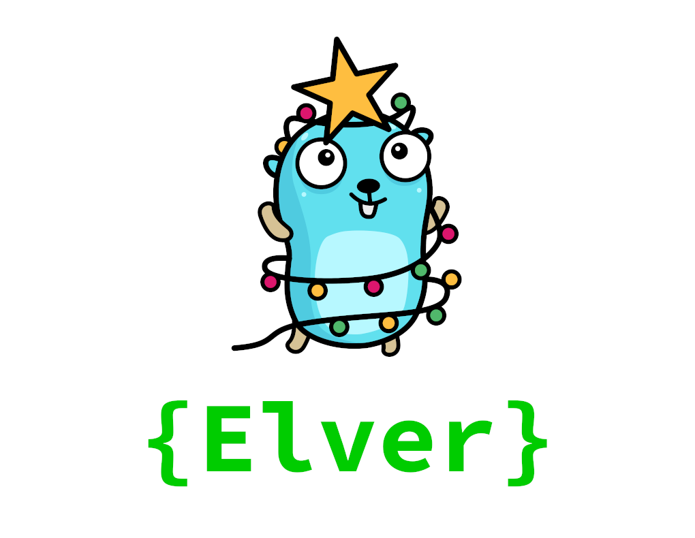

---

[Features](#features)
| [How does it work?](#how-does-it-work)
| [Getting started](#getting-started)
| [Examples](#examples)
| [Similar](#similar)

---


[](https://github.com/aod/elver/releases)
[](https://github.com/aod/elver/actions?query=workflow%3AGo)
[](https://pkg.go.dev/github.com/aod/elver?tab=overview)

Run your Go Advent of Code solutions with a single command.
Write your solution and Elver will take care of the rest.

# Features

- Automatically downloads and caches the input
- Runs your latest solution and times it
- Automatic benchmarking of your solution
- 0 third party dependencies

# How does it work?

Elver uses plugin build mode to dynamically look up the solutions.
These must reside in an Advent of Code folder under the main package.

# Getting started

## 1. Install

```console
$ go get github.com/aod/elver
```

## 2. Session token

Your https://adventofcode.com session token is required for downloading and caching the inputs.

### 2.A Environment variable

Set your Advent of Code session token in the environment variable `AOC_SESSION`.

### 2.B Config file

Alternatively you can store it in the `aoc_session` file in the
following directory:

- Linux: `$HOME/.config/elver/`
- MacOS: `/Library/Application Support/elver/`
- Windows: `%AppData%\elver\`

## 3. Project structure

A solution for a day in an Advent of Code year is represented by 2 solvers for part A and B.
All solvers are functions which satisfy the same signature where `interface{}` is the output:

`func (input string) (interface{}, error)`

For the plugin build mode to work correctly all solvers must be exported.
The name of a solver is also very important for elver to work properly.
It's name must satisfy the following set of rules:

- Starts with `Day`
- Followed by a valid Advent of Code day
    - Within (inclusive) range of `1..25`
- Ends with `A` for part 1 or `B` for part 2.

Solvers are workspaced by the Advent of Code year which is also used as the folder name.

### Example

```go
// /2015/01.go
package main

import "errors"

func Day1A(input string) (interface{}, error) {
    return 42, nil
}

func Day1B(input string) (interface{}, error) {
    return nil, errors.New("Not implemented")
}
```

Running Elver in the root directory will output something like the following:

```console
$ elver
AOC 2015
Day 1 A (312ns):
42
Day 1 B (956ns):
[ERROR] Not implemented
```

### Benchmarking

Run Elver with the `-b` flag to benchmark your latest solution:

```console
$ elver -b
AOC 2015
Day 1 A (N=231919370, 5 ns/op, 0 bytes/op, 0 allocs/op):
42
Day 1 B (N=0, 0 ns/op, 0 bytes/op, 0 allocs/op):
[ERROR] Not implemented
```

# Examples

Running the latest **solver**:

```console
$ elver
```

Running the latest **solver** of a specific year:

```console
$ elver -y 2017
```

Running the latest **solver** of a specific day:

```console
$ elver -d 21
```

Running the specific **solver** of a year and day:

```console
$ elver -y 2017 -d 21
```

Benchmarking a **solver** by adding the `-b` flag

```console
$ elver -b
// Works with any combination of the previously mentioned flags e.g.:
$ elver -y 2017 -d 21 -b
```

# Similar

These type of utility tools for Advent of Code also exist for other programming languages like
[cargo-aoc](https://github.com/gobanos/cargo-aoc)
(Rust)
and
[aocd](https://github.com/wimglenn/advent-of-code-data)
(Python).
Elver finds inspiration in these awesome projects so be sure to check them out as well!
