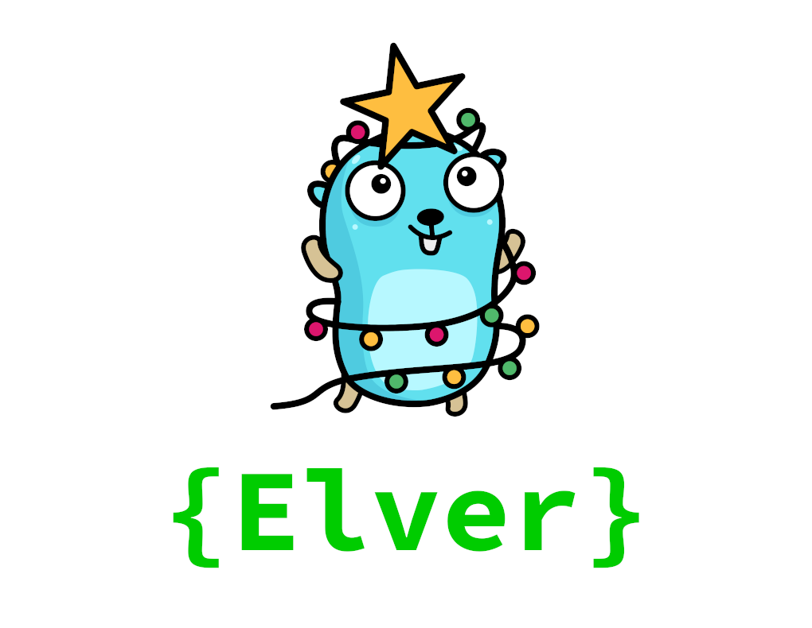

Run your Go Advent of Code solutions with a single command. 
Write your solution and Elver will take care of the rest.

# Features

- Automatically downloads and caches the input
- Runs your latest solution and times it
- Automatic benchmarking of your solution
- 0 third party dependencies

# How does it work?

Elver uses plugin build mode to generate a `.so` file to dynamically look up the solutions.
Solutions must be in an _advent folder_ in a **main** package which is required by the plugin build mode.
A solution represents a day and a part and is defined as `func Day[1..25][A|B]...` e.g.:

```go
// /2015/01.go
package main

import "errors"

func Day1A(input string) (interface{}, error) {
    return 42, nil
}

func Day1B(input string) (interface{}, error) {
    return nil, errors.New("Not implemented")
}
```

Running Elver in the root folder will generate `/2015/2015.so` and output the following:

```console
$ elver
AOC 2015
Day 1 A (312ns):
42
Day 1 B (956ns):
[ERROR] Not implemented
```

# Quick start

## 1. Install


```console
$ go get github.com/aod/elver
```

## 2. Cookie

Set your Advent of Code session token in the environment variable `AOC_SESSION`.
This variable is used to automatically download your inputs and cache them.

# Benchmarking

Run Elver with the `-b` flag to benchmark your latest solution:

```console
$ elver -b
AOC 2015
Day 1 A (N=231919370, 5 ns/op, 0 bytes/op, 0 allocs/op):
42
Day 1 B (N=0, 0 ns/op, 0 bytes/op, 0 allocs/op):
[ERROR] Not implemented
```

# Similar

These type of utility tools for Advent of Code als exist for other programming languages like
[cargo-aoc](https://github.com/gobanos/cargo-aoc)
(Rust)
and
[aocd](https://github.com/wimglenn/advent-of-code-data)
(Python).
Elver finds inspiration in these awesome projects so be sure to check them out as well.
